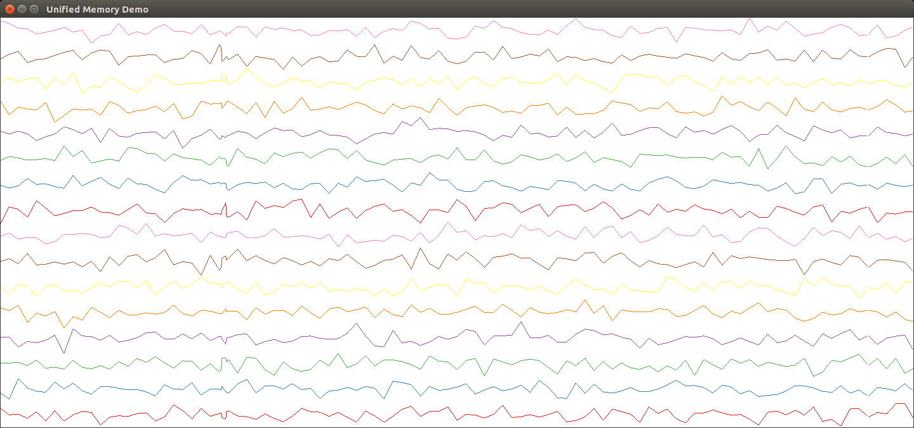

# Unified Memory Heterogenous Computing Showcase

This is the software project to demonstrate heterogenous computing.
This project is accompanying the presentation "Introduction into Shared Memory Programming on Heterogeneous Systems" from the parallel 2018 conference.

## Demo overview

The demo contains two executables.
The first is a basic data generator that mimicks a sensor that regularly emits measurements.
The second executable is a data processing and visualization tool that displays multiple line charts.

### sensor

The sensor executable takes up to two positional command line arguments:
1. number of sensors to mimick
2. emittance timing in microseconds

Example output for 4 sensors and approximately one measurement each 2000 microseconds (2 milliseconds):
```bash
$ ./sensor 4 2000
49;96.5644;101.006;99.7248;89.3221
2301;97.3029;100.952;99.6132;90.5318
4451;98.0413;100.899;99.5016;91.7415
6601;98.7798;100.846;99.39;92.9512
8703;99.5183;100.793;99.2784;94.1609
10796;100.257;100.74;99.1668;95.3706
12898;100.995;100.687;99.0552;96.5803
15038;101.734;100.634;98.9436;97.79
17180;102.472;100.581;98.832;98.9997
19328;103.211;100.527;98.7204;100.209
21487;103.949;100.474;98.6088;101.419
```

### unifiedmemory

Example command line:
```bash
$ ./sensor 4 20 | ./unifiedmemory
```



## Build from Source

This project depends on the following libraries:

* [CMake](https://cmake.org/) 3.0 or higher
* [glm](https://github.com/g-truc/glm) 0.9.7 or higher
* [glfw](http://www.glfw.org/) 3.0 or higher
* [glbinding](https://github.com/cginternals/glbinding) 3.0 or higher
* [cpplocate](https://github.com/cginternals/cpplocate) latest release
